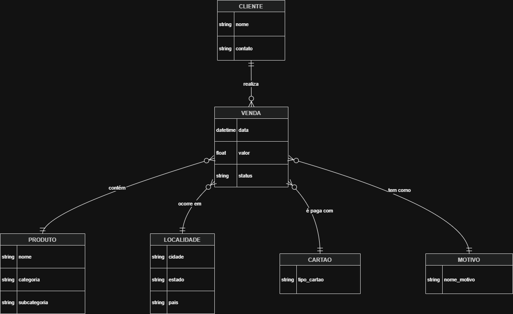

# Adventure Works - Projeto dbt & Modern Data Stack

Este repositório contém o pipeline de dados da **Adventure Works**, estruturado para transformar dados transacionais brutos em um modelo dimensional (**Star Schema**) otimizado para Business Intelligence. O projeto utiliza o **dbt (data build tool)** sobre a infraestrutura do **Databricks (Lakehouse)**.

## 🎯 Objetivo
O foco principal é a conversão dos dados complexos do ERP Adventure Works em uma camada de negócios confiável, garantindo integridade referencial, métricas calculadas e documentação completa da linhagem dos dados.

---

## 🏗️ Estrutura de Camadas (Medallion Architecture)

O pipeline segue uma estrutura modular para garantir manutenibilidade e escalabilidade:

### 1. Camada de Origem (Sources/Raw)
Mapeamento direto dos dados brutos no Databricks.

### 2. Camada de Staging (Silver)
Limpeza, padronização de tipos e saneamento de dados.

### 3. Camada Intermediate
Consolidação de joins complexos e cálculo de métricas de negócio (Valor Bruto e Líquido).

### 4. Camada Marts (Gold)
Entrega final no formato **Star Schema** (Dimensões e Fatos).

---

## 📊 Modelagem e Entrega

### 1. Modelo Conceitual
Abaixo está a visão conceitual do projeto, mapeando o plano de execução:

* 📄 [Download do Modelo Conceitual em PDF](./modelo_conceitual.drawio.pdf)

### 2. Diagrama Dimensional (Star Schema)
Representação visual da modelagem dimensional final (Camada Gold) utilizada para as análises no BI:

* 📄 [Download do Diagrama Dimensional em PDF](./Cópia%20do%20Diagrama%20CEA_AW_JT%20-%20.drawio.pdf)

### 3. Dashboard Power BI
O relatório final foi desenvolvido no Power BI, conectando-se diretamente às tabelas Gold processadas pelo dbt.

*  [**Baixar Dashboard (.pbix)**](./Dashboard%20AventureWorks%20-%20JT.pbix)

### 4. Apresentação do Projeto
Vídeo demonstrativo com a explicação técnica de ponta a ponta.

*  [**Assistir Apresentação no Google Drive**](https://drive.google.com/file/d/11KFz26PQTgDbiXu7LayVQjygE3L9wB5G/view?usp=sharing)

---

## 🧪 Qualidade e Governança de Dados
A confiança nos dados é garantida através de testes automatizados:

* **Testes de Unicidade e Nulidade:** Aplicados em todas as chaves primárias.
* **Integridade Referencial:** Testes de `relationships` na tabela fato.
* **Auditoria Financeira:** Teste customizado `verifica_soma_vendas_2011` para validação de faturamento anual.

---
